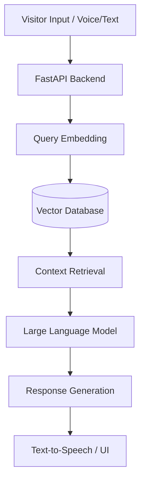

# Overview

Building an AI-powered receptionist capable of answering user queries using Retrieval-Augmented Generation (RAG). The system is designed to act as the first point of contact, assisting visitors by providing organization-specific information, scheduling, and routing inquiries while maintaining natural, conversational interactions.

This project is part of my ongoing internship work at **AIGenThix**, bridging the gap between cutting-edge LLMs and practical enterprise automation.

## The Problem

Traditional front-desk operations and rule-based chatbots are highly inefficient. Visitors often ask highly specific questions (e.g., "Where is Dr. Smith's office?" or "What are the compliance requirements for guest WiFi access?"). Static chatbots fail at contextual understanding, and human receptionists can become a bottleneck during peak hours.

## Technical Architecture

The AI Receptionist is built on a modern Generative AI stack emphasizing low latency and high accuracy.

### 1. Retrieval-Augmented Generation (RAG)
Instead of fine-tuning an LLM—which is expensive and difficult to update—we use RAG. The organization's data (employee directories, floor plans, FAQs, policies) is chunked, converted into high-dimensional vector embeddings, and stored in a Vector Database. 

When a visitor asks a question, the system searches the Vector DB for the most semantically relevant documents and passes that context to the LLM to generate a precise, hallucination-free answer.

### 2. Conversational Memory
To ensure interactions feel natural, the system implements session-based conversational memory. It remembers the context of the current conversation, allowing users to ask follow-up questions without repeating themselves.

## Challenges & Solutions

**Preventing Hallucinations:**
In an enterprise environment, an AI giving incorrect information is unacceptable. We implemented strict system prompts and confidence thresholds. If the Vector Database does not return context with a high similarity score, the bot is programmed to gracefully degrade and say, *"I'm sorry, I don't have that information. Let me connect you with a human representative."*

**Latency Optimization:**
Voice-based reception requires sub-second response times. We optimized the pipeline by exploring faster, specialized embedding models and optimizing our vector search indices.

## Future Roadmap

- **Voice Integration:** Integrating high-quality Speech-to-Text (STT) and Text-to-Speech (TTS) models to allow natural verbal conversations.
- **Hardware Integration:** Deploying the software stack onto physical robotic kiosks stationed at office entrances.
- **Action Execution:** Enabling the bot to trigger actions via APIs, such as sending a Slack notification to an employee when their guest arrives.
