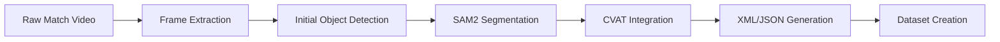

# Overview

Developing a complete annotation and segmentation pipeline for table tennis analytics. The system leverages CVAT, Segment Anything Model (SAM), and Computer Vision techniques to generate high-quality annotations for players, rackets, tables, and balls. 

The long-term objective is to evaluate player performance, identify playing styles, and extract actionable match data automatically.

## Problem Statement

Manual annotation of sports videos—especially fast-paced sports like table tennis—is extremely time-consuming and expensive. To build robust AI models for sports analytics, massive amounts of pixel-perfect labeled data are required. Existing datasets often lack the specificity needed for nuanced table tennis analysis (e.g., distinguishing between a forehand and backhand racket angle).

## Core Objectives

1. **Detect and Track Players:** Maintain persistent IDs for both players across the match.
2. **Detect Rackets:** Identify the exact position and orientation of the rackets.
3. **Detect the Table:** Segment the playing surface and edges accurately.
4. **Track the Ball:** Consistently track the high-speed ball despite motion blur.

## Technical Architecture & Workflow

The pipeline is designed to be highly automated, reducing the human-in-the-loop requirement to a minimum.

### 1. Frame Extraction & Preprocessing
Raw video feeds are broken down into discrete frames. We apply preprocessing techniques using **OpenCV** to enhance contrast and reduce motion blur, which is particularly critical for tracking the ping-pong ball traveling at high velocities.

### 2. Segment Anything Model (SAM2) Integration
We utilize Meta's SAM2 for zero-shot segmentation. By providing specific prompts (bounding boxes from an initial lightweight detection model), SAM2 generates highly accurate, pixel-perfect masks for the players, the table, and the rackets.

### 3. Automated CVAT Pipeline
The generated masks and bounding boxes are programmatically uploaded to **CVAT** via its REST API. This allows human annotators to simply verify or slightly adjust the AI-generated annotations rather than drawing them from scratch, accelerating the annotation process by over 80%.

## Technical Challenges Overcome

**High-Speed Motion Blur:** 
The biggest challenge in table tennis analytics is tracking the ball. Due to its size and speed, it often appears as a translucent streak rather than a solid sphere. We are addressing this by implementing multi-frame temporal tracking and predictive filtering (Kalman Filters) rather than relying solely on single-frame detection.

**Occlusion Handling:**
Players frequently occlude the racket and the ball. The pipeline maintains object persistence using advanced tracking algorithms to predict the location of occluded objects based on their velocity trajectory.

## Current Results & Next Steps

Currently, the system successfully generates automated annotations for static elements (the table) and large moving elements (players) with high confidence. 

**Next Steps:**
- Refining the ball-tracking algorithm to handle extreme motion blur.
- Packaging the entire pipeline into a standardized **Docker** container for easy deployment.
- Beginning the training phase of a custom YOLO model using the generated dataset for real-time edge inference.
