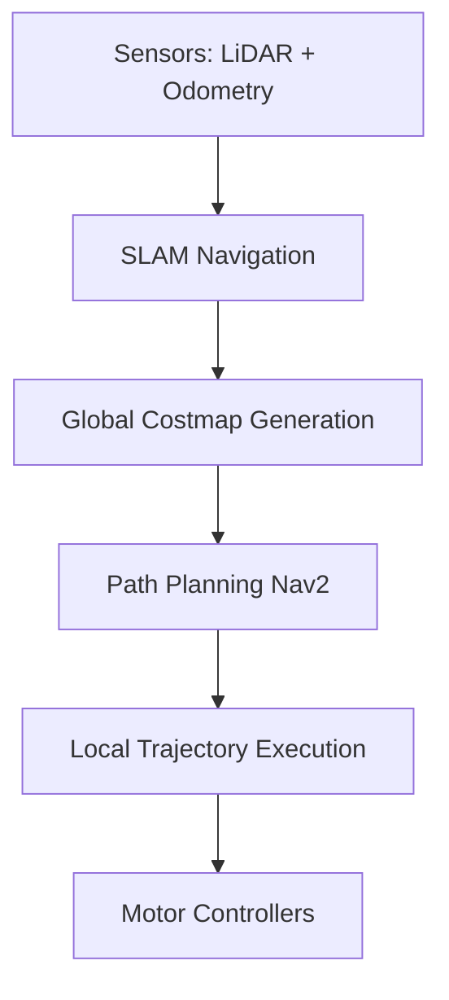

# Overview

Developing a comprehensive, autonomous campus assistant robot from the ground up for Vijaybhoomi University (VU). This project represents a complete intersection of mechanical engineering, embedded systems, modern robotics software (ROS2), and Artificial Intelligence.

The robot is designed to navigate the campus autonomously, assist students and faculty, and act as a mobile information kiosk.

## Project Scope & Objectives

Building a physical robot that operates in a dynamic, unstructured environment (a university campus) is a multifaceted challenge. The project is divided into three primary domains:

### 1. Mechanical & Hardware Design
Using **Fusion 360**, the robot's physical chassis is being custom-designed to be stable, lightweight, and capable of traversing the varied terrain of the campus (ramps, tiled floors, outdoor pathways). 

The hardware stack includes:
- LiDAR sensors for 2D/3D mapping
- Depth cameras (e.g., Intel RealSense) for obstacle avoidance
- Drive motors with precise encoders for odometry
- Edge compute unit (NVIDIA Jetson or Raspberry Pi 4)

### 2. Autonomous Navigation (ROS2 & Nav2)
The software brain of the robot is built on **ROS2 (Robot Operating System 2)**. We are utilizing the Nav2 stack for autonomous navigation. 

The robot maps the campus using Simultaneous Localization and Mapping (SLAM). Once the map is generated, it can accept a target destination (e.g., "Library") and dynamically plan a path, continuously recalculating to avoid dynamic obstacles like walking students.

### 3. AI Interaction Layer
To make the robot genuinely useful, it features an AI interaction layer. We are integrating a Retrieval-Augmented Generation (RAG) system similar to my AI Receptionist project. The robot will have a localized database of campus information (class schedules, event locations, faculty directories) allowing users to verbally ask questions and get accurate, context-aware answers.

## Current Progress

- ✅ Initial mechanical CAD designs completed in Fusion 360.
- ✅ ROS2 environment setup and simulated navigation tested in Gazebo.
- 🔄 Sensor integration and SLAM mapping of the initial building floors.
- 🔄 Development of the physical prototype chassis.

## Expected Outcomes

The successful deployment of the VU Campus Bot will demonstrate end-to-end expertise in modern robotics. It serves as a practical, real-world platform to test advanced navigation algorithms and edge AI deployments, ultimately proving the viability of service robots in educational institutions.
